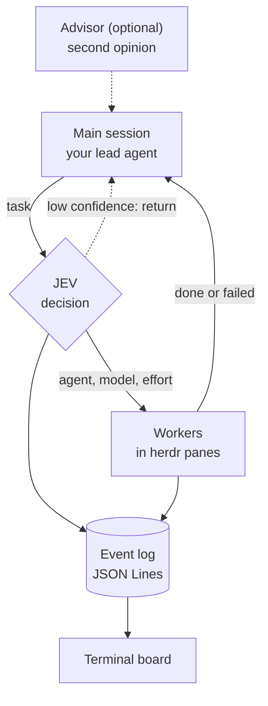

# azir-dispatch

**English** | [简体中文](README.zh-CN.md)

[](LICENSE) [](https://www.python.org/downloads/)

Scan the QR code with WeChat to join the “JEV WorkFlow 交流” group.


This QR code is valid before October 11, 2026.

**Route tasks across coding agents, log every dispatch, and follow the work live in your terminal.**

azir-dispatch is a Python tool for developers coordinating coding agents in [herdr](https://herdr.dev). It uses [JEV](https://openrouter.ai/docs/guides/community/jev), a decision model served by OpenRouter, to select an agent, model, and reasoning effort for each task from your configured options. Every dispatch is recorded in a local JSON Lines log and shown on a live terminal board.


## Why azir-dispatch

- **Route each task.** When several coding agents work in parallel, JEV selects the agent, model, and reasoning effort for each task from your configured options.
- **Keep a local audit trail.** Dispatches, completions, failures, and returns to the main session are appended to a JSON Lines log for replay and auditing.
- **Follow the work live.** The terminal board shows your main session, JEV, and workers, with events animated as they happen.

## Quick start

### Try the demo

The demo requires Python 3.11+, but no API key or herdr installation:

```sh
git clone https://github.com/JosssphZhou/azir-dispatch.git
cd azir-dispatch
python3 bin/azir-dispatch demo   # replays the run shown above; press q to quit
```

### Set up task routing

Real dispatches require [herdr](https://herdr.dev), a terminal multiplexer for coding agents: the board and every worker run in herdr panes. JEV routing requires an OpenRouter API key; without one, azir-dispatch uses your configured defaults.

Give this prompt to any coding agent that can read a repository and run shell commands, such as Claude Code, Codex, or Grok:

> Follow `skills/setup/SKILL.md` in this repository to install azir-dispatch and run one dispatch: https://github.com/JosssphZhou/azir-dispatch

The setup process checks your environment, installs herdr, saves your role configuration, opens the board, and dispatches your first task. For manual installation, see [INSTALL.md](INSTALL.md).

## How it works



When JEV's confidence is at or above the threshold (0.7 by default, configurable per decision point), the adapter uses its answer. Below the threshold, the decision returns to the main session. If JEV times out or returns an error, the decision point uses its configured default.

| Decision point | When it runs | Output |
| --- | --- | --- |
| `dispatch` | Before a task is sent | Agent, model, and reasoning effort from your configured options |
| `skill` | Before a task is sent | A candidate skill for the current scope, or `none` |
| `next_step` | After a task fails | `continue`, `rethink`, or `stop` |
| `wrapup` | After a task completes | `close_and_clean`, `close_keep`, or `keep` |

The `next_step` and `wrapup` responses are recommendations for the main session. The reference adapters never retry, close panes, or clean up worktrees on their own.

The four roles are main session, development, review, and research. You choose an agent and model for each role; if only one agent CLI is installed, all four roles share it.

Run `azir-dispatch roles` to review each role's agent, model, and effort, test it with one short call, and save changes.


**Optional advisor.** The advisor uses your own ChatGPT Pro subscription to provide a second opinion and requires the ego lite browser. See [docs/advisor.md](docs/advisor.md).

## herdr plugin

```sh
herdr plugin install JosssphZhou/azir-dispatch
```

The plugin adds three panes: the board (`board`), a JEV decision view (`jev`), and an office view (`office`, Node 18+) that draws each agent at a desk. It reads configuration from `~/.config/azir-dispatch/config.toml` or the file specified by `AZIR_DISPATCH_CONFIG`.

## Adapters

The core is independent of herdr and any specific coding agent. An adapter dispatches tasks and reports whether they complete or fail. Two reference adapters ship with the repository, using only the Python standard library:

- **Claude Code:** a `PreToolUse` hook that routes subagent calls to the agent JEV selects, plus hooks that report completion and failure.
- **Codex:** `bin/azir-dispatch-codex`, a wrapper around `codex exec` that asks JEV first and reports the outcome.

To connect another agent, see [docs/adapters.md](docs/adapters.md) (Chinese).

## Privacy

With JEV enabled, `decide` sends the task state to OpenRouter as text. Before the request is sent, built-in filters replace text matching common formats for API keys, bearer tokens, private keys, and JWTs, and the text is truncated to 4,000 characters by default. Without an OpenRouter API key, azir-dispatch runs in rules mode: it applies your configured defaults and sends no requests. Filtering cannot catch everything, so add your own patterns; see [docs/privacy.md](docs/privacy.md) (Chinese).

## Documentation

The guides under `docs/` are currently in Chinese.

- [INSTALL.md](INSTALL.md): manual installation.
- [docs/setup.md](docs/setup.md): setup responses, roles, `doctor`, and manual JEV configuration.
- [docs/architecture.md](docs/architecture.md): core API, decision points, and the event log format.
- [docs/adapters.md](docs/adapters.md): reference adapters, offline checks, and custom adapter development.
- [docs/dashboard.md](docs/dashboard.md): the terminal board, JEV decision view, and office view.
- [docs/privacy.md](docs/privacy.md): what is sent, what is filtered, and what is stored locally.
- [CONTRIBUTING.md](CONTRIBUTING.md): running tests and the pre-release privacy scan.

## Related projects and acknowledgements

- [herdr-jev](https://github.com/flaviomartil/herdr-jev) also uses JEV to route tasks and pick models across agents. It is a herdr plugin with a per-agent status view and approvals.
- [herdr-office](https://github.com/michaellandi/herdr-office) by Mike Landi is the upstream project for the code in `office/`, copied from commit `12ca55c` under the MIT License. The upstream license and copyright notice are kept in [office/LICENSE](office/LICENSE); see [office/NOTICE](office/NOTICE). azir-dispatch adds the JEV, dispatch, and advisor overlays.
- [herdr](https://herdr.dev) provides the panes that the board and workers run in.

## License

azir-dispatch is released under the [MIT License](LICENSE). Code in `office/` retains its upstream MIT license.
