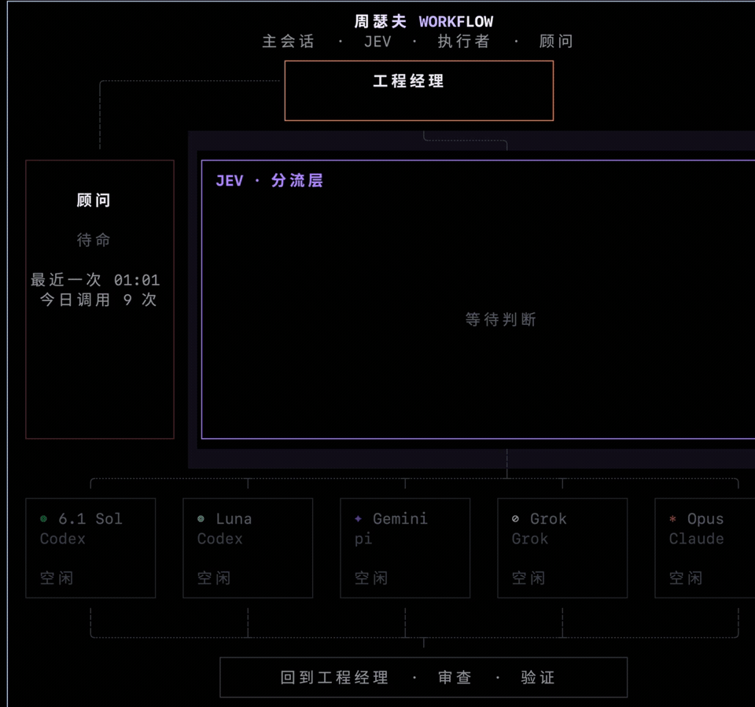
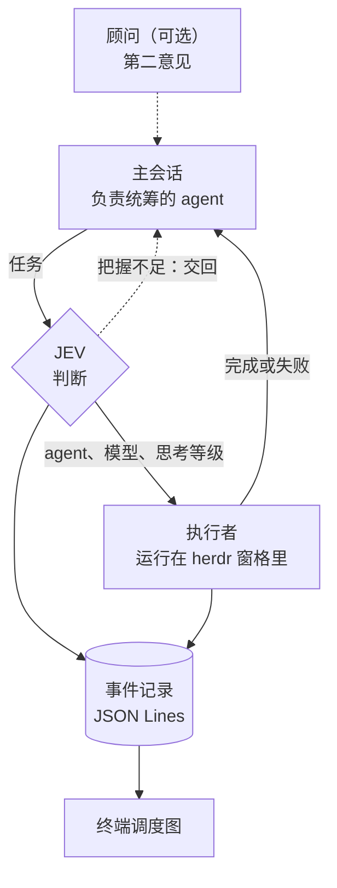
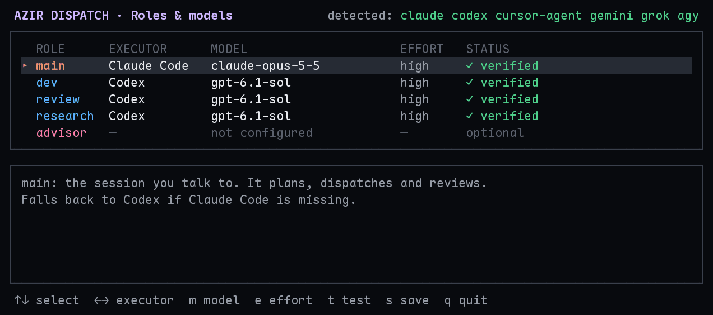

# azir-dispatch

[English](README.md) | **简体中文**

[](LICENSE) [](https://www.python.org/downloads/)

**给多个 coding agent 分派任务，记录每一次派发，在终端里实时查看工作进展。**

azir-dispatch 是一个 Python 工具，面向在 [herdr](https://herdr.dev) 里协调多个 coding agent 的开发者。它用 OpenRouter 提供的判断模型 [JEV](https://openrouter.ai/docs/guides/community/jev)，在你配置的选项里为每个任务选出 agent、模型和思考等级。每次派发都写进本机的 JSON Lines 记录，并在实时的终端调度图上显示。

用微信扫码加入「JEV WorkFlow 交流」微信群。


此二维码在 2026 年 10 月 11 日前有效。



## 它解决什么问题

- **为每个任务选执行者。** 多个 coding agent 并行工作时，JEV 在你配置的选项里为每个任务选出 agent、模型和思考等级。
- **在本机留下完整记录。** 派发、完成、失败和交回主会话都追加到 JSON Lines 记录里，可以回放，也可以事后核查。
- **实时查看工作进展。** 终端调度图显示主会话、JEV 和各个执行者，事件发生时播放动画。

## 快速开始

### 先看演示

演示只需要 Python 3.11+，不需要密钥，也不需要安装 herdr：

```sh
git clone https://github.com/JosssphZhou/azir-dispatch.git
cd azir-dispatch
python3 bin/azir-dispatch demo   # 回放上图中的一轮派发，按 q 退出
```

### 配置任务派发

真实派发需要 [herdr](https://herdr.dev)。它是为 coding agent 设计的终端复用器，调度图和每个执行者都运行在 herdr 的窗格里。JEV 判断需要 OpenRouter 密钥；没有密钥时，azir-dispatch 采用你配置的默认答案。

把下面这句话交给能读仓库并执行命令的 coding agent，例如 Claude Code、Codex、Grok：

> 照这个仓库的 `skills/setup/SKILL.md` 引导装好 azir-dispatch 并跑一次派发：https://github.com/JosssphZhou/azir-dispatch

安装引导会检测环境、安装 herdr、保存角色配置、打开调度图，并派发第一个任务。手工安装见 [INSTALL.md](INSTALL.md)。

## 工作原理



JEV 的把握达到设定值（默认 0.7，每个判断点可以单独调整）时，适配器采用它的答案。低于设定值时，这次判断交回主会话。JEV 超时或返回错误时，判断点采用配置的默认答案。

| 判断点 | 何时触发 | 输出 |
| --- | --- | --- |
| `dispatch` | 派发任务之前 | 从你配置的选项里选出的 agent、模型和思考等级 |
| `skill` | 派发任务之前 | 当前范围候选里的一个技能，或 `none` |
| `next_step` | 任务失败之后 | `continue`、`rethink` 或 `stop` |
| `wrapup` | 任务完成之后 | `close_and_clean`、`close_keep` 或 `keep` |

`next_step` 和 `wrapup` 的答案是给主会话的建议。参考适配器不会自行重试、关闭窗格或清理工作树。

角色分为主会话、开发、审查和调研四个。每个角色用哪个 agent 和模型由你配置；只装了一个 agent 命令行工具时，四个角色共用它。

运行 `azir-dispatch roles`，可以查看每个角色用哪个 agent、模型和强度，用一句话的真实调用测试，并保存修改。



**可选顾问。** 顾问用你自己的 ChatGPT Pro 订阅给出第二意见，需要安装 ego lite 浏览器，详见 [docs/advisor.md](docs/advisor.md)。

## herdr 插件

```sh
herdr plugin install JosssphZhou/azir-dispatch
```

插件提供三个窗格：调度图（`board`）、JEV 判断视图（`jev`），以及把每个 agent 画在工位上的办公室视图（`office`，需要 Node 18+）。插件从 `~/.config/azir-dispatch/config.toml` 读取配置，也可以用 `AZIR_DISPATCH_CONFIG` 指定配置文件。

## 适配器

核心不依赖 herdr，也不绑定某一个 coding agent。适配器负责派发任务，并报告任务完成还是失败。仓库自带两个参考适配器，只用 Python 标准库：

- **Claude Code：** 一个 `PreToolUse` hook，把子代理调用改派给 JEV 选中的 agent，另有报告完成和失败的 hooks。
- **Codex：** `bin/azir-dispatch-codex`，包装 `codex exec`，先问 JEV，再报告结果。

接入其他 agent 的方法见 [docs/adapters.md](docs/adapters.md)。

## 隐私

启用 JEV 后，`decide` 会把任务现状以文字形式发送到 OpenRouter。发送前，内置过滤会替换符合常见格式的 API 密钥、Bearer 令牌、私钥和 JWT，文字默认截断到 4000 个字符。没有 OpenRouter 密钥时，azir-dispatch 运行在规则模式：采用你配置的默认答案，不发送任何请求。过滤不能识别所有敏感内容，请按自己的数据添加规则，详见 [docs/privacy.md](docs/privacy.md)。

## 文档

- [INSTALL.md](INSTALL.md)：手工安装。
- [docs/setup.md](docs/setup.md)：安装引导的答案、角色、`doctor` 和手工配置 JEV。
- [docs/architecture.md](docs/architecture.md)：核心接口、判断点和事件记录格式。
- [docs/adapters.md](docs/adapters.md)：参考适配器、离线核对和自己写适配器。
- [docs/dashboard.md](docs/dashboard.md)：终端调度图、JEV 判断视图和办公室视图。
- [docs/privacy.md](docs/privacy.md)：发送什么、过滤什么、本机保存什么。
- [CONTRIBUTING.md](CONTRIBUTING.md)：运行测试和发布前的隐私扫描。

## 相关项目和致谢

- [herdr-jev](https://github.com/flaviomartil/herdr-jev) 同样用 JEV 给多个 agent 分派任务和选模型。它是 herdr 插件，带按 agent 显示状态并能批准操作的界面。
- [herdr-office](https://github.com/michaellandi/herdr-office) 由 Mike Landi 开发，是 `office/` 目录代码的上游项目。`office/` 复制自上游提交 `12ca55c`，按 MIT 许可证使用。上游许可证和版权声明保留在 [office/LICENSE](office/LICENSE)，来源说明见 [office/NOTICE](office/NOTICE)。azir-dispatch 在其上增加了 JEV 判断、派发记录和顾问状态的显示。
- [herdr](https://herdr.dev) 提供调度图和执行者运行所在的窗格。

## 许可证

azir-dispatch 以 [MIT 许可证](LICENSE) 开源。`office/` 目录的代码保留上游的 MIT 许可证。
